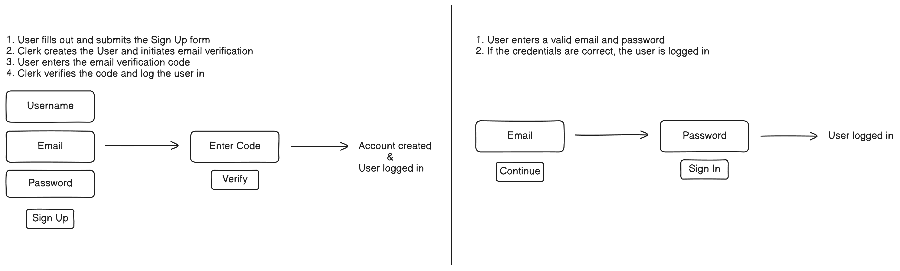

# KraftedY

## Directory Structure

```
├── src
│   ├── app
│   │   ├── (auth)
│   │   │   ├── sign-in
│   │   │   │   └── [[...sign-in]]
│   │   │   ├── sign-up
│   │   │   │   └── [[...sign-up]]
│   │   ├── (protected)
│   │   │   │   └── dashboard
│   ├── components
│   │   └── gradients
│   │   |       └── AnimatedBackground.tsx
│   │   └── ui
│   │   |    └── Spinner.tsx
│   │   ├── AuthHeader.tsx
│   │   ├── Dashboard.tsx
│   ├── middleware.ts
├── .env.local
├── next.config.js
├── package.json
├── tsconfig.json
```

## Installation

### Steps to Install

1. Clone the repository:

   ```bash
   git clone https://github.com/iamatifmoin/kraftedy.git
   cd kraftedy
   ```

2. Install the dependencies:
   Using npm:
   ```bash
   npm install
   ```
   Or using Yarn:
   ```bash
   yarn install
   ```

### Running the Development Server

To run the application locally:

1. Run the development server:

   ```bash
   npm run dev
   ```

   Or with Yarn:

   ```bash
   yarn dev
   ```

2. Visit `http://localhost:3000` in your browser to access the application.

## Environment Variables

Create a `.env.local` file in the root of the project and add the following variables:

```env
NEXT_PUBLIC_CLERK_PUBLISHABLE_KEY=<your-clerk-publishable-key>
CLERK_SECRET_KEY=<your-clerk-secret-key>
NEXT_PUBLIC_CLERK_SIGN_IN_URL=/sign-in
NEXT_PUBLIC_CLERK_SIGN_UP_URL=/sign-up
NEXT_PUBLIC_CLERK_SIGN_IN_FALLBACK_REDIRECT_URL=/dashboard
NEXT_PUBLIC_CLERK_SIGN_UP_FALLBACK_REDIRECT_URL=/dashboard
```

Replace `<your-clerk-publishable-key>` and `<your-clerk-secret-key>` with the appropriate values from your Clerk dashboard.

## Test Credentials

```
username: test-user
email: test@kraftedy.com
password: thisIsForTesting
```

## Auth Flow



### 1. Sign Up Flow

When a user clicks the "Sign Up" button, they are redirected to Clerk's modal or page for sign-up. Once the user successfully registers:

- Clerk creates a user profile and sends a confirmation email.

- After confirming their email, the user is granted access to the app.

- The user is redirected to the Dashboard page that they were trying to access before signing up.

### 2. Sign In Flow

When a user clicks the "Sign In" button, they are redirected to Clerk’s modal or page for sign-in. Upon successful authentication, the following occurs:

- Clerk verifies the user's credentials.

- The user is granted access to the app and is redirected to the Dashboard or their desired page.

### 3. Authentication Check on Dashboard Page

To ensure only authenticated users can access the Dashboard page, authentication checks are implemented. These checks are done both on the server-side and client-side:

- Server-side Authentication Check:
  The auth function from Clerk is used in API routes or server-side functions to verify if a user is authenticated.

If the user is not authenticated, they are redirected to the Sign-In page.

- Client-side Authentication Check:
  On the client side, SignedIn and SignedOut components from Clerk are used to conditionally render content based on whether the user is authenticated.

These components automatically handle redirection and showing appropriate content.

## Prompts used

Prompt 1: How can I implement route protection with Clerk to ensure users are redirected to the sign-in page if they are not authenticated?

Prompt 2: How do I check for authentication on protected pages?

Prompt 3: What is the use of the following- NEXT_PUBLIC_CLERK_SIGN_IN_FALLBACK_REDIRECT_URL,
NEXT_PUBLIC_CLERK_SIGN_UP_FALLBACK_REDIRECT_URL

Prompt 4: What does the error 'URL is malformed' mean when using Clerk in Next.js?

Prompt 5: How can I customize the redirect URL for a sign-in or sign-up button in Clerk in my Next.js app?
